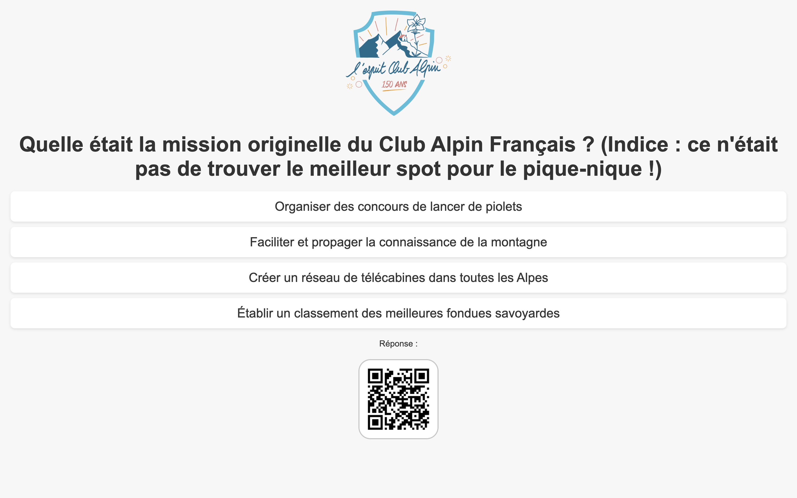

# Quiz Application

This is a minimalist quiz application built with Fastify, featuring PDF generation and QR codes for answers.



## Features

- Display a list of quiz questions
- Show individual questions with multiple-choice answers
- Generate QR codes for answer URLs
- Create PDF documents for each question

## Prerequisites

- Node.js
- npm

## Installation

1. Clone the repository:
   ```
   git clone git@github.com:cbouvard/quiz.git
   cd quiz
   ```

2. Install dependencies:
   ```
   npm install
   ```

3. Update the `questions.json` files with your quiz question.

4. Update the `views/*.ejs` and `public/logo.png` with your context.

## Usage

1. Start the server:
   ```
   node app.js
   ```

2. The server will start on port 3000 by default. You can change this by setting the `PORT` environment variable.

3. Access the application in your web browser at `http://localhost:3000`.

## Routes

- `/questions`: List all questions
- `/questions/:questionId`: Display a specific question
- `/questions/:questionId/answer`: Show the answer to a specific question
- `/questions/:questionId/answer/qrcode`: Generate a QR code for the answer URL
- `/questions/:questionId/pdf-document`: Generate a PDF document for a specific question

## Project Structure

- `app.js`: Main application file
- `views/`: Directory containing EJS templates
- `public/`: Directory for static files (including `logo.png`)
- `questions.json`: JSON file containing quiz questions (you need to update this)

## Dependencies

- `fastify`: Web framework
- `@fastify/static`: Plugin for serving static files
- `@fastify/view`: Plugin for template rendering
- `ejs`: Templating engine
- `pdfkit`: PDF generation library
- `qrcode`: QR code generation library

## Environment Variables

- `PORT`: Port number for the server (default: 3000)

## License

MIT
